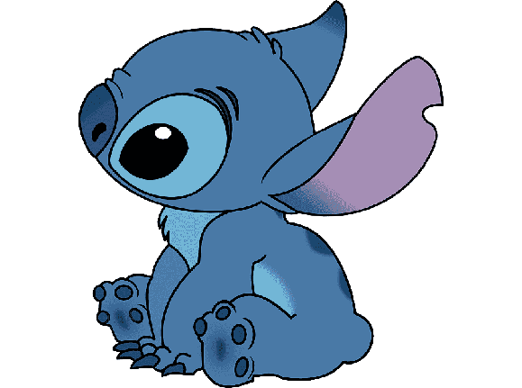

```java
class AboutMe{

    private static final String NOME = "Camila Ferreira";
    private String[] paixoes = {"leitura","café","animações","músicas"};
    private String profissao = "Software developer";
    private String curso = "Ciência da Computação na UFF";
    
}
```

<h2> :computer: Sobre o git: </h2>
<div style = "position: relative;">
  
  
  
 

</div>

<h2> :coffee: Como entrar em contato? </h2>

<a href='https://www.linkedin.com/in/camila-ferreira-a10a72204/'> </a>
 
